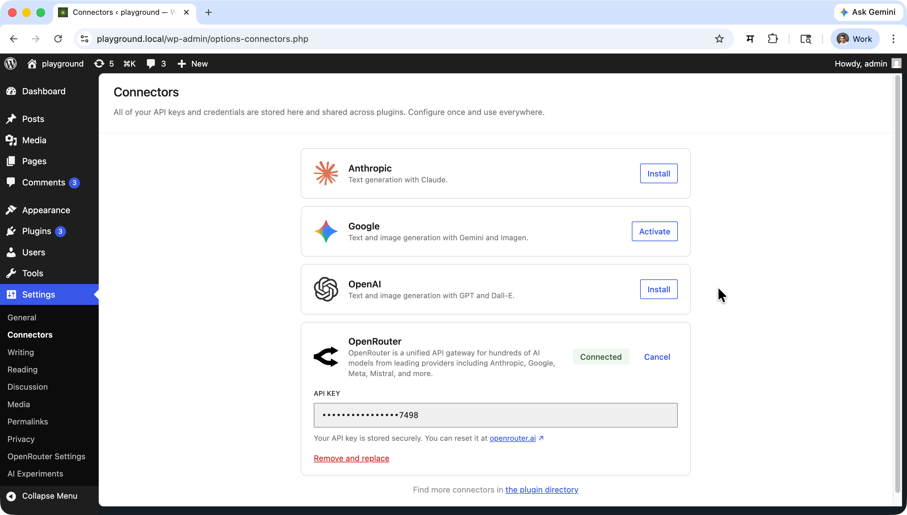
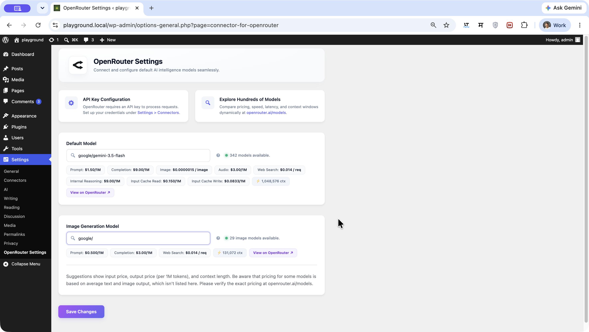
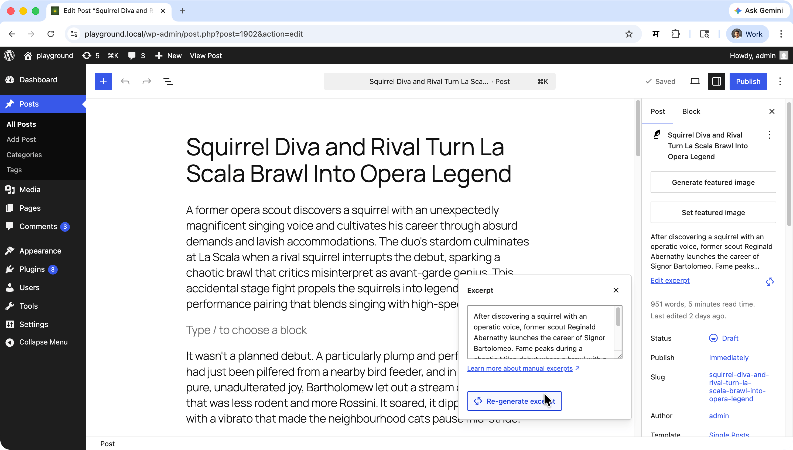
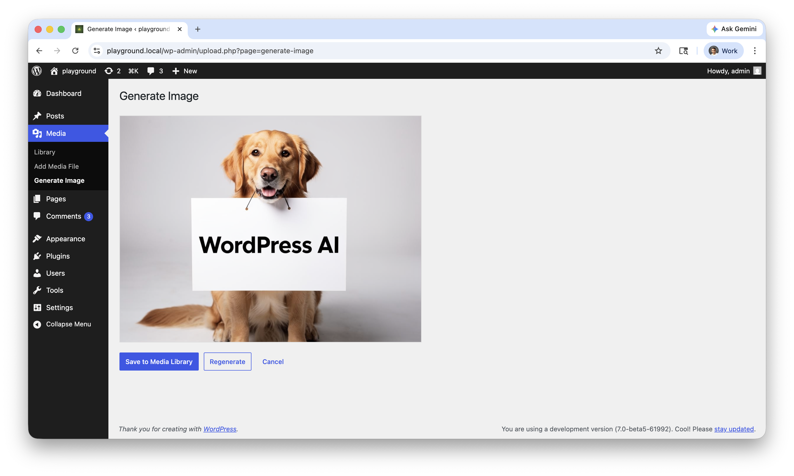

# Connector for OpenRouter - Access Hundreds of AI Models in WordPress

**Contributors:** [rtCamp](https://profiles.wordpress.org/rtcamp/), [milindmore22](https://profiles.wordpress.org/milindmore22), [vishal4669](https://profiles.wordpress.org/vishal4669/), [aviralmittal89](https://profiles.wordpress.org/aviralmittal89/)

**Tags:** WordPress, AI, OpenRouter, Text Generation, Image Generation, AI Models, ChatGPT, Claude, Gemini

This plugin is licensed under the GPL v2 or later.

## Overview

Connector for OpenRouter is a WordPress plugin that registers OpenRouter as an AI provider for the WordPress AI Client. It gives you access to hundreds of AI models for text and image generation through a single, unified API — configurable directly from your WordPress admin.

## Description

**Connector for OpenRouter** bridges the WordPress AI Client with OpenRouter's model marketplace, allowing you to:

* **Access hundreds of AI models** including GPT-4, Claude, Gemini, and more through a single API key
* **Generate text** using any OpenRouter-supported language model
* **Generate images** using OpenRouter-supported image models
* **Configure default models** for text and image generation from WordPress admin settings
* **Switch models** without changing any code — just update your admin settings

This makes it easy to experiment with and deploy different AI models on your WordPress site without being locked into a single provider.

## Why Connector for OpenRouter?

Managing multiple AI providers in WordPress typically requires separate plugins, multiple API keys, and custom integrations for each model. This leads to:

- **Vendor lock-in** with individual AI providers
- **Integration overhead** when switching or adding new models
- **Duplicate configuration** scattered across multiple plugins
- **Maintenance burden** as each provider's API evolves independently

Connector for OpenRouter solves this by:

- **Unified Access:** One API key, hundreds of models from leading AI providers
- **Standardized Interface:** All models exposed through the WordPress AI Client's consistent API
- **Flexible Configuration:** Switch models from admin settings — no code changes required
- **Separation of Concerns:** Provider logic isolated from your application code

### Key Benefits

- **Model freedom:** Not locked into a single AI vendor — swap models anytime
- **Cost efficiency:** Route requests to the most cost-effective model for each task
- **Future-proof:** New models added to OpenRouter become immediately available
- **Simple setup:** One API key and two settings fields to get started

## Features

### Core Functionality

- **Text Generation:** Text generation support via OpenRouter's chat completions endpoint
- **Image Generation:** Image generation via OpenRouter's chat completions image modality
- **Model Discovery:** Settings autocomplete backed by live model discovery.
- **Dual Model Config:** Separate default model settings for text and image generation
- **Smart Exposure:** If both settings point to the same model, it is exposed once with combined capabilities
- **Environment Overrides:** `OPENROUTER_BASE_URL` and `OPENROUTER_API_KEY` constants for advanced deployments

### API Integration

The plugin communicates with OpenRouter's OpenAI-compatible API at `https://openrouter.ai/api/v1`:

| Endpoint | Purpose |
|---|---|
| `GET /models` | Populate text model autocomplete in settings |
| `GET /models?output_modality=image` | Populate image model autocomplete in settings |
| `POST /chat/completions` | Text generation requests |
| `POST /chat/completions` + `modalities: ["image"]` | Image generation requests |

### Limitations

- Only models available through OpenRouter are supported; models exclusive to other providers require separate plugins.
- Image generation depends on OpenRouter's supported image models — availability may vary.
- The plugin exposes only the two models configured in settings (text and image); dynamic per-request model selection is not supported at this time.

## System Requirements

- **WordPress:** 7.0 or higher
- **Requires at least:** 7.0
- **Tested up to:** 7.0
- **Stable tag:** 1.1.0
- **PHP:** 7.4 or higher
- **Requires PHP:** 7.4
- **Required Plugin:** [WordPress AI Client](https://wordpress.org/plugins/ai/) (`ai`) must be active

## Installation & Setup

### As a WordPress Plugin

1. Ensure the **WordPress AI** plugin (`ai`) is installed and activated.
2. Download or clone this plugin into `wp-content/plugins/connector-for-openrouter`.
3. Activate **Connector for OpenRouter** from the Plugins screen.
4. Add your OpenRouter API key in **Settings > Connectors**.
5. Configure your default models in **Settings > OpenRouter Settings**.

### As a Composer Package

```bash
composer require rtcamp/connector-for-openrouter
```

## Usage Guide

### Accessing the Settings

Navigate to **Settings > OpenRouter Settings** in your WordPress admin to configure Connector for OpenRouter.

### Configuring Connector for OpenRouter

#### Setting Up Your API Key

1. Obtain an API key from [OpenRouter](https://openrouter.ai/).
2. In WordPress admin, go to **Settings > Connectors**.
3. Enter your OpenRouter API key and save.



#### Selecting Default Models

1. Navigate to **Settings > OpenRouter Settings**.
2. Select your **Default Model** for text generation (autocompleted from live OpenRouter model list).
3. Select your **Image Generation Model** for image generation tasks.
4. Save your settings.



### Text Generation
Text generation requests are routed through OpenRouter's chat completions endpoint:

```json
{
	"model": "your-text-model",
	"messages": [
		{
			"role": "user",
			"content": "Write a short poem about WordPress plugins."
		}
	]
}
```
#### WordPress Ability
You can use OpenRouter for any WordPress AI Client feature that supports text generation, such as:
- Title generation
- Excerpt generation
- Content Summarization



### Image Generation

Image generation is routed through OpenRouter chat completions with the image modality:

```json
{
    "model": "your-image-model",
    "messages": [
        {
            "role": "user",
            "content": "A serene mountain landscape at sunrise"
        }
    ],
    "modalities": ["image"]
}
```
#### WordPress Ability
Use OpenRouter for any AI Client feature that supports image generation, such as:
- Featured image generation
- Media library image generation



### Environment Overrides

For advanced deployments, you can override defaults using PHP constants or environment variables:

- `OPENROUTER_BASE_URL` — Override the API base URL (default: `https://openrouter.ai/api/v1`)
- `OPENROUTER_API_KEY` — Inject an API key directly when the Connectors registry is not yet initialised

## Development & Contributing

Connector for OpenRouter is actively developed and maintained by [rtCamp](https://rtcamp.com/).

- **Repository:** [https://github.com/rtcamp/connector-for-openrouter](https://github.com/rtcamp/connector-for-openrouter)

We welcome contributions! Please open an issue or pull request on GitHub.

### PHP

```bash
composer run-script lint
composer run-script format
composer run-script phpstan
```

### JavaScript

```bash
npm run lint:js
npm run lint:js:fix
```

### Combined Lint

```bash
npm run lint
```

### Build Release Zip

```bash
npm run plugin-zip
```

This creates `connector-for-openrouter.zip` in the plugin root, excluding all development-only files.

## Frequently Asked Questions

### What is OpenRouter?

[OpenRouter](https://openrouter.ai/) is a unified API gateway that provides access to hundreds of AI models from providers like OpenAI, Anthropic, Google, Meta, and many others through a single, OpenAI-compatible API.

### Do I need separate API keys for each AI model?

No. You only need a single OpenRouter API key. OpenRouter handles routing your requests to the appropriate underlying model provider.

### Does this plugin require the WordPress AI Client plugin?

Yes. The **WordPress AI** plugin (`ai`) must be installed and activated. This plugin registers OpenRouter as a provider within that framework.

### Can I use both text and image generation?

Yes. Configure a text model in the **Default Model** field and an image model in the **Image Generation Model** field in **Settings > OpenRouter Settings**.

### Can I use the same model for both text and image generation?

Yes. If you set both fields to the same model ID, the plugin registers that model once with combined text and image capabilities.

### What happens if I don't configure an API key?

The connector will be registered but inactive. AI Client requests routed to OpenRouter will fail until valid credentials are set in **Settings > Connectors**.

### How do I switch to a different AI model?

Update the **Default Model** or **Image Generation Model** fields in **Settings > OpenRouter Settings**. No code changes are required.

### Does this affect front-end performance?

No. All AI provider logic runs server-side and only when AI Client requests are made. There is no front-end JavaScript impact from this plugin.

### Is multisite supported?

The plugin can be network-activated on multisite. Each site's settings are managed independently via their own **Settings > OpenRouter Settings** page.

## Troubleshooting

### No models appearing in the settings dropdowns

- Verify your OpenRouter API key is saved in **Settings > Connectors**.
- Check that the **WordPress AI** plugin is active.
- Confirm your API key has the necessary permissions on [openrouter.ai](https://openrouter.ai/).

### Text or image generation failing

- Ensure the selected model exists and is available in your OpenRouter account tier.
- Check the browser console and PHP error log for detailed error messages.
- Verify the `OPENROUTER_BASE_URL` constant (if set) points to the correct endpoint.

### Settings not saving

- Check file permissions and database write access.
- Look for conflicting plugins that may be overriding the settings page.

### Common Issues

- **Model not found errors:** The selected model may have been deprecated or renamed by OpenRouter — re-select a model from the settings dropdown.
- **Authentication errors:** Double-check the API key in **Settings > Connectors** and ensure it is not expired.
- **Image generation returning no output:** Confirm the selected image model supports image generation via `modalities: ["image"]`.

## Support & Community

- **Issues & Bug Reports:** [GitHub Issues](https://github.com/rtcamp/connector-for-openrouter/issues)
- **Source Code:** [GitHub Repository](https://github.com/rtcamp/connector-for-openrouter)

## License

This project is licensed under the GPL v2 or later — see the [LICENSE](LICENSE) file for details.

---

**Made with ❤️ by [rtCamp](https://rtcamp.com/)**
